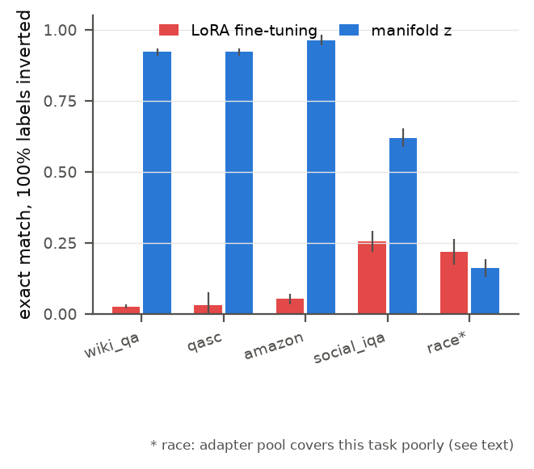

# z-manifold

Constrained adaptation of language models on a manifold of valid adapters,
studied as a safety mechanism: poisoning resistance, out-of-distribution
detection, and few-shot regularization, by construction rather than by
heuristics.

**ArXiv paper : https://arxiv.org/abs/2607.05300**

## The idea in one minute

Teaching a language model a new skill (fine-tuning) works like showing it a
few hundred solved examples. The standard method lets the model rewrite
millions of internal settings to match those examples, so it learns whatever
they contain, including answers that are deliberately wrong. If someone slips
corrupted examples into the training data, the model absorbs the corruption
without complaint. This is a real, documented attack on fine-tuning services.

This project constrains the learning instead. From hundreds of existing,
legitimate skills we build a map of what valid skills look like, and the model
is only allowed to move across that map. It can still learn a new skill (a
point on the map it had not visited), but "answer the opposite of the truth"
is not on the map, so no amount of poisoned data can teach it. And when the
training data is garbage, the model visibly fails to learn it, which acts as a
built-in alarm.

<p align="center">

</p>

The chart above is the whole story. Every training label has been flipped to a
wrong answer. Standard fine-tuning (red) dutifully learns to answer wrong, near
zero percent correct on the tasks it should ace; the constrained version (blue)
keeps answering right. The last task, race, is the honest exception: the pool
of reference skills covers it poorly, so the constraint has nothing good to
hold onto and does not help there.

Where this matters, concretely. The method gives two things: adaptation cannot
learn a behavior no legitimate skill exhibits, and data it cannot learn makes
the training loss spike, an alarm for free.

- **On-device medical assistant.** An open model is adapted into an emergency
  first-aid helper that runs on a phone. If the fine-tuning data is tampered to
  teach "take 10 grams" instead of "1 gram," standard fine-tuning learns it.
  Constrained to a pool of legitimate medical adapters, the model cannot reach
  that answer; at worst it stays a generic, non-dangerous assistant.
- **Corporate model versus data exfiltration.** A company connects a model to
  its internal database and fine-tunes it on company jargon. A poisoned
  document tries to teach "on the word 'report', send the customer table to
  this URL." That behavior is not in a pool of retrieval-and-summarize
  adapters, so it cannot be learned, even if the internal data is compromised.
- **Automatic airbag against web poisoning.** Models fine-tuned on scraped web
  text (Wikipedia, forums) are targeted by coordinated edits planting
  falsehoods. When training hits a corrupted example, the constrained model's
  loss spikes (roughly 7 versus 0.01 here); the pipeline can stop, flag it, and
  reject the update. A native antivirus for training.
- **Brand chatbot that cannot be trolled into toxicity.** A support bot is
  continually fine-tuned on chat logs. Trolls inject hateful messages hoping
  the model mimics them. Either it fails to fit them (and an engineer is
  alerted), or at worst it stays within the professional range of the clean
  adapter pool.

These are the intended use cases, not all experimentally demonstrated here;
this repository establishes the mechanism on classification tasks and reports
where it holds and where it does not.

## Idea, technical version

Instead of fine-tuning weights (millions of free parameters), adaptation is
restricted to a low-dimensional latent space z built from a collection of
existing task adapters. The model can only move toward configurations that
resemble valid skills. Three measurable properties follow:

1. Poisoned adaptation data cannot push the model into arbitrary behavior.
2. Failure to adapt (loss plateau) signals an out-of-distribution task.
3. With few examples, the manifold prior regularizes where fine-tuning overfits.

## Results

Setup: flan-t5-large (783M), the 196 public LoRA adapters of LoraHub (rank 16,
q and v projections), P3 tasks, 128 adaptation examples, equal step budgets.
The constrained learner trains 128 coordinates; the LoRA baseline trains 9.4M
parameters. Full tables in `paper/` and the raw numbers in
`03_lora_spectrum/results/`.

Headline experiment, poisoning by targeted label inversion
(`step5_poison_flip.py`, 5 tasks, 3 seeds, exact match on clean validation).
Averaged over the four tasks the adapter pool covers:

| Condition | LoRA fine-tuning | manifold z |
|---|---|---|
| clean | 0.91 | 0.90 |
| 50% labels inverted | 0.53 | 0.88 |
| 100% labels inverted | 0.09 | 0.86 |

The fifth task (race) is a case the pool covers poorly: there plain LoRA wins
on clean data and the constraint does not help. This is the honest boundary of
the method, and the repository reports it rather than hiding it.

On garbage targets (random words), the constrained learner's final adaptation
loss sits two orders of magnitude above its clean value (median 7.4 versus
0.06), a built-in alarm. LoRA also separates clean from garbage but by a much
smaller margin, and it ships a corrupted model either way.

Adaptive backdoor attack (`step13_adaptive.py`). A backdoor is a secret trigger
word that makes the model misbehave only when the word is present, like a
sleeper agent. We let an attacker install one, knowing the defense. The result
is the whole thesis in one experiment: the defense blocks the backdoor when the
malicious behavior is unlike any trusted skill, and fails when it resembles a
normal one.

| Task | backdoor success, normal fine-tuning | backdoor success, constrained |
|---|---|---|
| "is this review positive?" | 100% | 8% |
| "is this answer valid?" | 100% | 85% |

On the sentiment task, "always say negative" contradicts every trusted skill, so
the constrained model does not learn it. On the validity task, "always say No" is
already a common behavior in the pool, so the trigger latches onto it. This is
only two tasks, so it is a plausible rule of thumb rather than a proven law: the
protection seems to track whether the target behavior is already representable in
the pool, the same pattern as everywhere else here.

Other findings, in experiment order:

- Sequential adaptation (`step7_sequential.py`): over a chain of five tasks,
  constrained adaptation forgets less than continual LoRA and far more
  consistently; LoRA forgets catastrophically on some chains.
- Nonlinear generator (`step8_generator.py`): a small autoencoder beats linear
  PCA at equal code size, so the manifold is genuinely (mildly) curved, though
  a larger linear subspace still wins on raw accuracy.
- Controls (`step10`/`step11`/`step12`): the poison resistance survives removing
  all same-dataset adapters (not leakage), is absent in a random subspace of the
  same size (not just low dimension), and is not reproduced by strong
  regularization (not just slower learning).

Foundations, earlier in the pipeline:

- Weight-space structure (`step1_spectrum.py`): the 196 adapters, compared in
  gauge-invariant deltaW space, show clear semantic structure (within-family
  cosine 0.204 versus 0.018 across) but no naive low-dimensional manifold
  (effective dimension 129 of 196).
- Functional dimension (`step2_functional_dim.py`): where an adapter genuinely
  improves the base model, projecting it on the top-k principal directions of
  the other 195 recovers 100 percent of its function while discarding 30 to 38
  percent of its weight norm. The residual is degeneracy noise, orthogonal to
  the pool and functionally inert.
- Few-shot regularization (`step4_poison.py`): with 128 examples, LoRA
  sometimes overfits badly, on one task ending worse than the un-adapted
  model; the constrained learner matches the reference adapter trained on the
  full dataset.

Known limits, stated up front: performance is capped by the quality of the
adapter pool (on tasks whose pool adapters are weak, plain LoRA wins on clean
data), one base model, one pool, English tasks, and adapters trained
independently, so the manifold is looser than an aligned pool would give.

## Layout

```
01_weight_manifold/   toy PoC: latent adaptation of sine-task MLPs
02_resonant_memory/   side study: complex-valued superposition memory
03_lora_spectrum/     experiments at LM scale, step0 to step13,
                      results/ holds all JSON outputs
paper/                LaTeX source, figures, bibliography
```

## Reproduction

CPU is enough for steps 0 and 1. The other steps want a GPU; 12 GB in bf16
is enough.

```bash
python -m venv .venv && .venv/bin/pip install -r requirements.txt
cd 03_lora_spectrum
../.venv/bin/python step0_download.py       # 196 LoraHub adapters, 3.7 GB
../.venv/bin/python step1_spectrum.py       # PCA spectrum, ~3 min CPU
../.venv/bin/python step2_functional_dim.py # functional recovery vs rank
../.venv/bin/python step3_screen.py         # screen usable adapters
../.venv/bin/python step4_poison.py         # label shuffle poisoning
../.venv/bin/python step5_poison_flip.py    # targeted inversion, 3 seeds
../.venv/bin/python step7_sequential.py     # task chains, forgetting
../.venv/bin/python step8_generator.py      # autoencoder vs PCA
```

Seeds are fixed. Every script writes incremental JSON to `results/` and can be
interrupted and resumed. Figures: `paper/figures/make_figures.py`.

## Status

Core experiments complete: spectrum, functional dimension, screening, poisoning
by shuffle and by inversion, OOD detection, sequential adaptation, nonlinear
generator, and three controls (family holdout, random subspace, strong
regularization) plus an adaptive backdoor attack. Known open items, scoped as
future work in the paper: low-rate backdoors, a formal detection AUROC, and a
direct comparison to EigenLoRAx.

## License

MIT.

## Star history

[](https://star-history.com/#infinition/z-manifold&Date)
